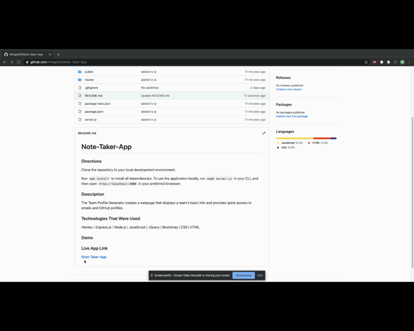

# Note-Taker-App

### Directions
Clone the GitHub repo.

Run `npm install` to install all dependencies. To use the application locally, run `node server.js` in your CLI, and then open `http://localhost:3000` in your preferred browswer.

Or to see a live demo of the Note Taker App click the link below.

### Description
The Note Taker App is for or users that need to keep track of a lot of information, it's easy to forget or be unable to recall something important. Being able to take persistent notes allows users to have written information available when needed.

### Technologies That Were Used
Heroku | Express.js | Node.js | JavaScript | JQuery | Bootstrap | CSS | HTML

### Demo

### Live App Link

[Note-Taker-App](https://lit-lowlands-32256.herokuapp.com/)

